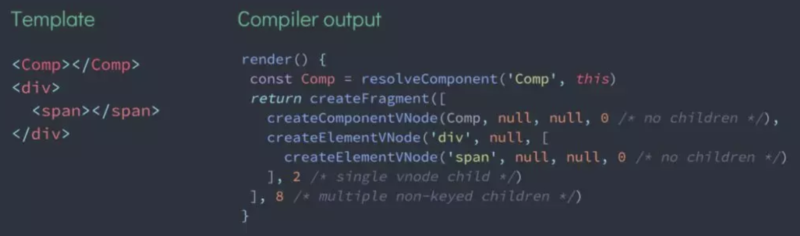
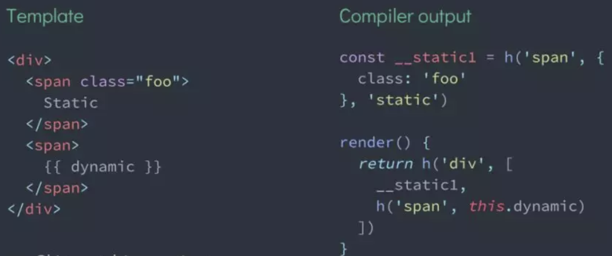
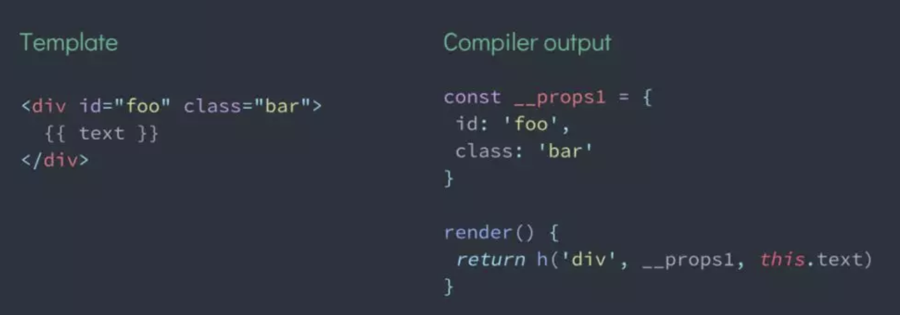
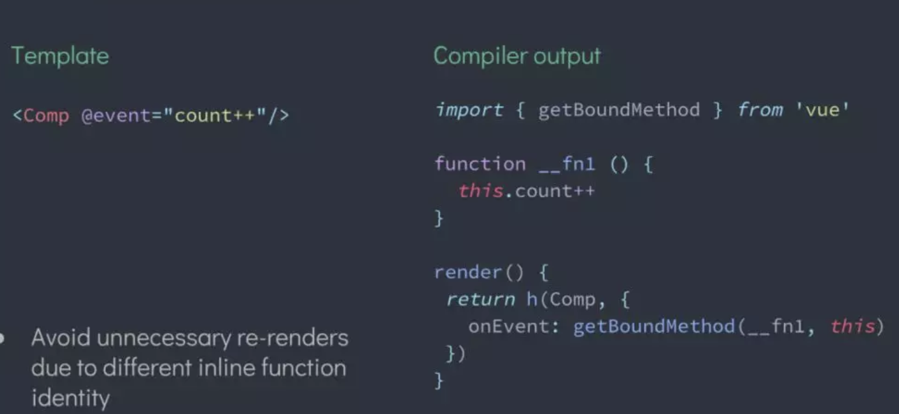
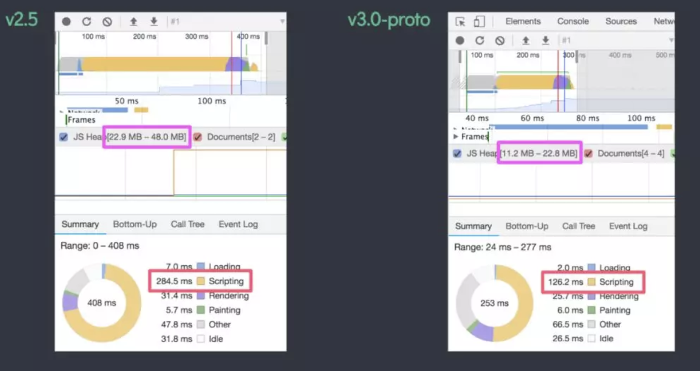
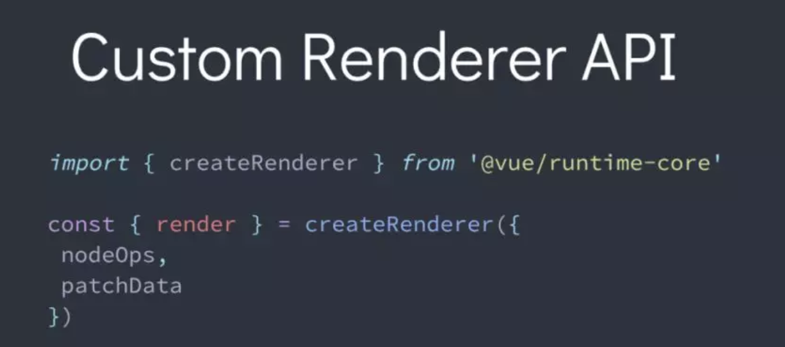
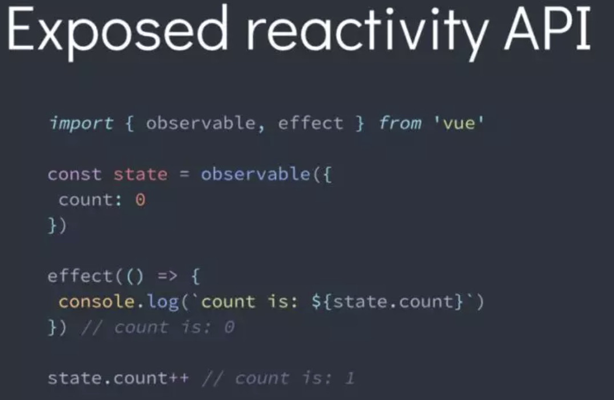
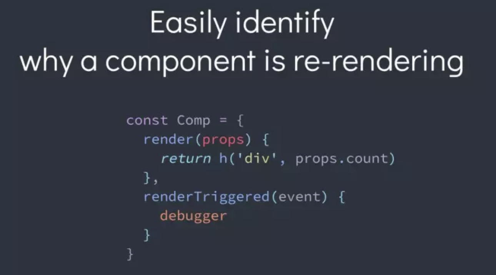

# Vue3.0 Updates
> - 资料来源大神 Evan You
> - 本文只是翻译和自己的一点期望

## Vue3.0将带来哪些变化？
> - 更快
> - 更小
> - 更易于维护
> - 更易于切合原生API
> - 状态管理更容易

### 更快
> - 重写Virtual DOM 底层实现机制
> - 挂载和patch(根据dom-diff计算差异结果)更加快捷

### 更多编译时提示以减少运行时开销
> - 组件快速路径
> - 单一调用方式
> - 子组件类型检测

> - 跳过不必要的条件分支
> - JS引擎优化

> - 静态树提升
> - 忽略计算整个树的差异
> - 即使出现多个static tree，也能提升

> - 静态props提升
> - 跳过DOM节点本身的patch,而保留子节点的patch

> - 内联方法提升
> - 避免由于内联函数标识不同，而引起的不必要的重新渲染

### 基于proxy代理模式 替代 原来的观察者模式，性能更优
> - 全部使用ES6来实现
> - Property addition/ deletion
> - Array index / length mutation
> - Map,Set, WeakMapm,WeakSet
> - Classes
#### 使用ES6 proxy 监听对象实例的属性
#### 更快的组件实例初始化
#### 优化内存，事半功倍，(一半的内存,两倍速率)

### 代码更小
> - 更友好的Tree-shaking
> > - 内置组件(keep-alive,transition...)
> > - 模版指令(v-model,v-for...)
> > - 公共函数(异步组件、mixins...)
> - new core runtime: 压缩后10kb

### 更易于维护
> - 使用 TypeScript
> - 解耦依赖包

> - 重写编译器

### 更易于切合原生API

### 状态管理更容易
> - 提供 状态监听 API

> - 兼听组件重新渲染更加容易

