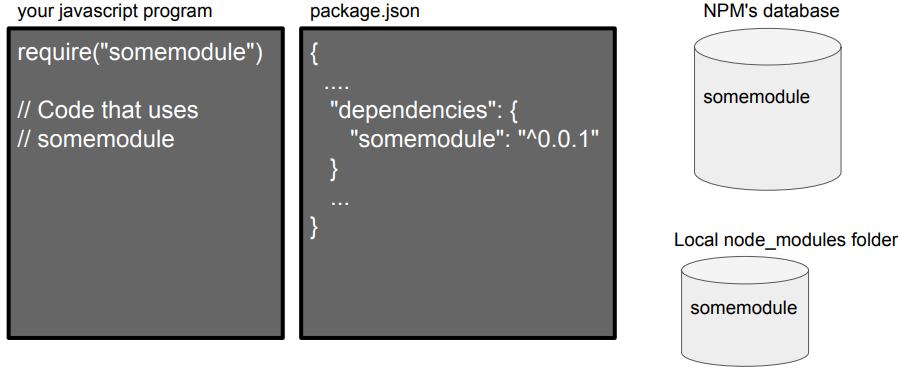
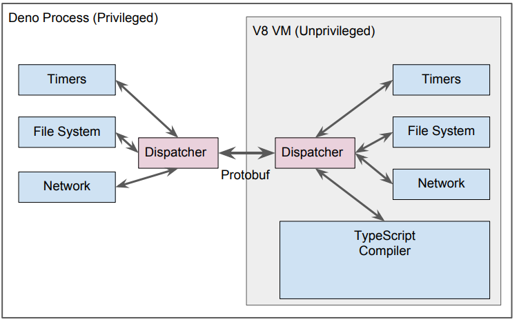
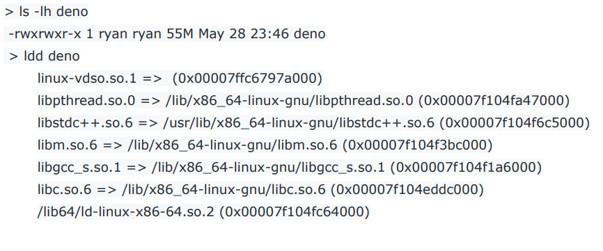

# node开发设计缺陷(译文)
> **翻译:小疯子**，原文出处(http://tinyclouds.org/jsconf2018.pdf)

##背景
> - 本人通过之前的开发经验创建和管理Node
> - 我本意主要是可以在HTTP服务器上编写事件驱动的程序
> - 这点对以前的web服务影响不打，但现在对对运行在服务端的javascript至关重要
2012年离开时，我觉得Node已经（或多或少）为用户实现了这一目标 - 友好的非阻塞框架
> - 核心支持许多协议：HTTP，SSL...
> - 支持多平台，Windows上（使用IOCP）Linux（使用epoll）和 Mac（使用kqueue）
> - 具有相对稳定的API，核心相对较小
> - 是通过NPM增加外部模块，从而形成的一个生态系统
但我过于乐观了，还有许多事情需要去做...

## 随着功能不断完善,使得Node在不断壮大
> - npm（又名 "又名“Isaac”"）促成了Node核心库的解耦，并对该生态系统支持分布式
> - N-API 设计精美的API
> - Ben Noordhuis和Bert Belder这两位创建了libuv
> - Mikeal Rogers负责组织管理和社区
> - Fedor Indutny对整个代码库有着重大的影响，尤其在加密部分
> - 其他贡献者: TJ Fontaine, Rod Vagg, Myles Borins, Nathan Rajlich, Dave Pacheco, Robert Mustacchi, Bryan Cantrill, Igor Zinkovsky, Aria Stewart, Paul Querna, Felix Geisendörfer, Tim Caswell, Guillermo Rauch, Charlie Robbins, Matt Ranney, Rich Trott, Michael Dawson, James Snell

```bash
我在过去6个月里才再次使用Node
现在我有了不同的目标
在科学计算中，您经常要快速开始一次性计算，而动态语言是恰当工具
此外，JavaScript是最好的动态语言。

恰恰相反，我会抱怨Node的所有缺陷
这些缺陷并不十分明显，尤其当你要处理其中某一个bug时
有时Node对我而言就像黑板上的钉子
它本来可以更好的
```

##遗憾1: node不支持Promises
> - 2009年6月我在Node中新增了promises，但在2010年2月，却愚蠢地删掉了它们
> - Promises是异步/等待的抽象处理
> - Node中统一使用promise可能最终会加速异步/等待标准化的实现
> - 今天Node很多异步API因此而被废弃

##遗憾2: 安全性
> - V8本身是一个非常好的安全沙箱
> - 如果不是因为我把更多的想法都放在了如何维护某些应用程序上，Node就可以拥有一些其他语言中不具备的安全保证。
> - 例如: 请求连接不能无限制地访问你的电脑和网络

##遗憾3: 构建系统(GYP)
> - 构建系统非常困难和重要的
> - V8(通过Chrome)已经开始使用GYP了，我已经将它集成到Node上了
> - 后来，Chrome因为GN删掉GYP，GYP就剩下了唯一用户-Node
> - GYP 并不是一个丑陋而无用的内部接口 - 它让外部可以调用V8引擎
> - 非常糟糕开发体验，它是非JSON，它是Python的改编版本

##遗憾4: package.json
> - Isaac 在NPM中的发明创建了包（package.json对于大多数情况）。
> - 但我允许Node通过require的方式来检查引入包文件
> - 最终我发布了Node,包括NPM标准协议
> - 不幸的是，它太依赖集中式（甚至是私有的）模块仓库了
require('somemodule') 并没什么用，还需要定义它


##遗憾5: package.json
> - 允许 package.json 将模块作为文件目录
> - 这并非严格必要的-而且在web并不存在模块的概念
> - 现在，package.json包含了各式各样的无用信息
> - License? Repository ? Description （牌照、仓库、描述）
> - 这就会形成冗余的样本文件
> - 如果在import时只使用相对文件或url，那么可以根据路径定义版本号，这就没必要再列出依赖项了


##遗憾6: node_modules
> - 它大大增加了模块解析算法的复杂化
> - 在默认情况下，供应者的意图是好的，但在实际开发中使用$NODE_PATH也无法解决该问题
> - 与浏览器语义化有很大的区别
> - 很不幸，目前还无法移除它

##遗憾7: require("module") without the extension ".js" 
> - 没必要，不明确
> - 浏览器现在还不支持这么写，在脚本标签src属性中，并不能省略扩展名".js"
> - 模块加载程序必须查询用户依赖文件的多处地址

##遗憾8: index.js
> - 我觉得在index.html使用它很傻
> - 它没必要地增加了模块的复杂度
> - 在需要支持package.json之后，这就变得更没必要了

与早期对事件I/O的关注相反，我对Node的疑问几乎完全围绕着他是如何管理用户代码
模块系统本质上是一个后置思想，考虑到这一点，我一直在思考如何做得更好...

**声明:** 我正在展示一个新生的原型
除非你想迫不及待地卷起袖子，跳进lldb，否则不要费心去构建它
也就是说……

Deno https://github.com/ry/deno (V8上TypeScript运行的环境)

## Deno目标1: 安全
> - 利用JavaScript是一个安全的沙箱这一现状
> - 默认无需网络或文件写权限，就能运行script脚本
> - 允许用户运行通过参数，选择使用权限 --allow-net --allow-write
> - 允许用户运行不受信任的程序(比如工具)
> - 不支持调用V8的原生方法
> - 系统调用都是通过消息传递来实现(protobuf的序列化)
> - 恰巧有两个原生方法:发送和接收
> - 这既简化了设计，又使得程序检查更容易


## Deno目标2: 简化模块系统
> - 不再兼容现有的Node模块
> - import只依赖相对或绝对路径(见语义版本控制)
```
import { test } from 'https://unpkg.com/deno_testing@0.0.5/testing.ts'
import { log } from './util.ts';
```
> - import必须提供一个扩展
> - 远程资源在第一次加载时，就永久缓存
> - 只有在reload时，才会从新获取资源
> - 提供者可以指定非默认缓存目录

## Deno目标3: 在可执行文件中内置的TypeScript编译器
> - TS绝对是优雅的
> - 终于可以使用如此实用的强类型语言
> - 可以由小而大地构建结构工程化结构良好的代码
> - Deno 钩子函数内联TS编辑器，这样就可以实现模块分析和高效地增量缓存
> - 修改的TS文件不应该重新编译
> - 普通JS也应有效(但这是微不足道的，因为TS是JS的超集)
> - 为满足快熟启动，我们应该使用V8快照功能(在prototype中还不支持)

## Deno目标4: 只使用超链接的单一可执行文件


## Deno目标5: 把握好2018
> - 用Parcel编译打包Node模块生成一个bundle引导文件（这是对过去的Node所做的大大的简化）
> - 原生代码中已存在恨好的基础框架
> - 例如: 不需要担心HTTP,有人已经实现它了（它并非是Node中的部分..web服务器100％支持）)
> - 目前Deno中的非JS部分正在使用Go，但我还没完全研究并掌控它(替代品已经完成了原型)
> - Rust可能是是一个不错的选择
> - 如果允许其他人构建自己的Denos，C++可能仍然是一个不错的选择
> - Go还是Rust

## Deno目标6: 驱动
> - 对未处理的promise,立即释放(Node的情况并非如此)
> - 支持最高级别的异步任务(prototype还不支持)
> - 浏览器兼容的功能重叠的部分


Deno https://github.com/ry/deno
它才诞生一个月，现在还不可用，但我对目前的设计很满意
It is very much not usable

评论?疑问?担忧? ry@tinyclouds.org